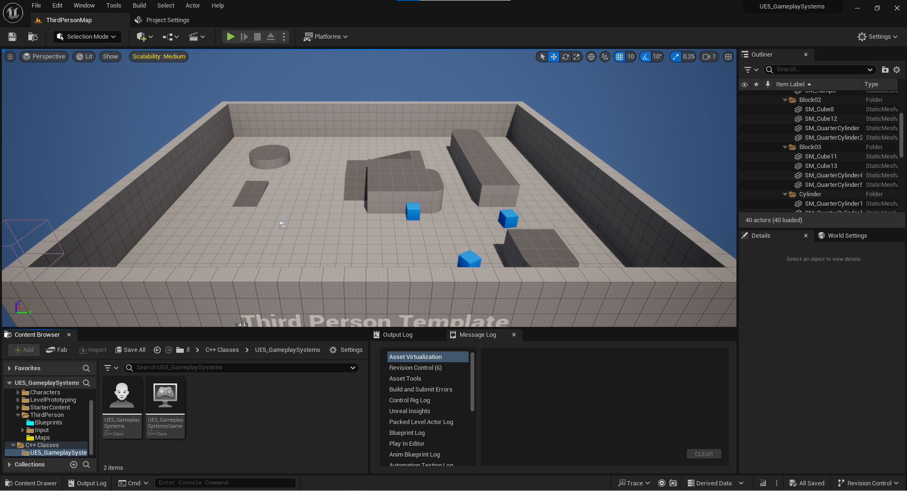
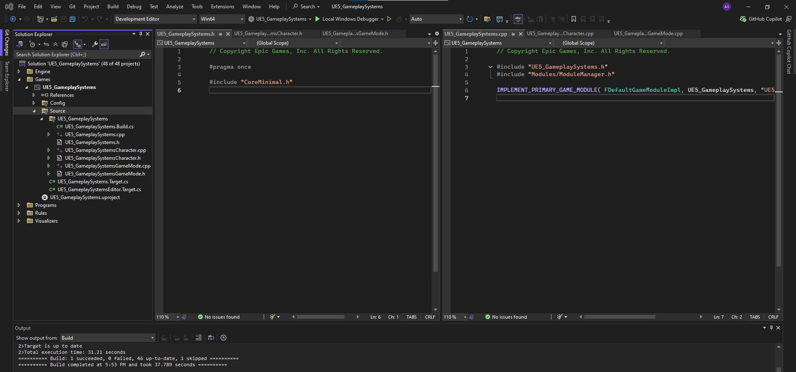
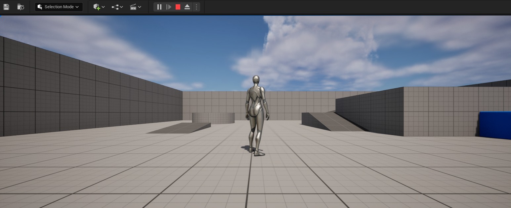
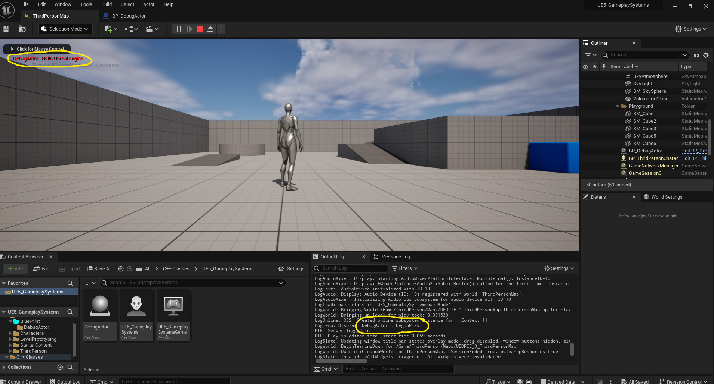

# UE5_GameplaySystems

## 📅 5\1\26
## 📘 Unreal Engine 5 C++ – Development Log

This file tracks my daily work, experiments, and observations
while building gameplay systems in **Unreal Engine 5 using C++**.

The purpose of this log is:
- Long-term reference
- Clear documentation of system-level understanding
- Tracking how gameplay code evolves over time

---

### Project Information
- **Project Name:** UE5-Gameplay-Systems
- **Engine:** Unreal Engine 5
- **Template:** Third Person (C++)
- **Language:** C++
- **Version Control:** GitHub

---

### Work Done
- Created a new Unreal Engine 5 project using the **Third Person C++ template**
- Set up GitHub repository for continuous version control
- Added this development log for documentation and iteration tracking

---

### Technical Notes
- The Third Person template provides a solid baseline for gameplay system development
- Movement, jumping, and camera logic are already implemented and can be extended later
- This setup allows focus on **system design and C++ architecture**.

---

### Repository :- **UE5_GameplaySystems**

🔗 GitHub :  [Anant Shah](https://github.com/AnantShah001)

[UE5_GameplaySystems](https://github.com/AnantShah001/UE5_GameplaySystems)

---

### Screenshots

**Unreal Editor**

**IDE / Source Code**

**Gameplay View**

---

🔗 [GitHub Previous Commit](https://github.com/AnantShah001/UE5_GameplaySystems/commit/b9555e0559055a49e76a37f8694d85c73b611429)

## 📅 Day 1 – Project Setup & Create DebugActor Class
- Created a new class called DebugActor derived from AActor.
- Blueprint child class derived from `ADebugActor`
- Used for level placement and iteration
- Demonstrates proper C++ → Blueprint inheritance workflow
- Implemented functionality to print debug messages using UE_LOG.
- Used GEngine->AddOnScreenDebugMessage to display messages on the game screen.

 > Blueprint Editor Terminology:
* `Viewport` = `This is where we can see our Actor in 3D Space`
* `Event Graph` = `This is Execute After Game Starts`
* `Construction_Script` = `This is Execute Before Game Starts`

**Showing Debugging**

