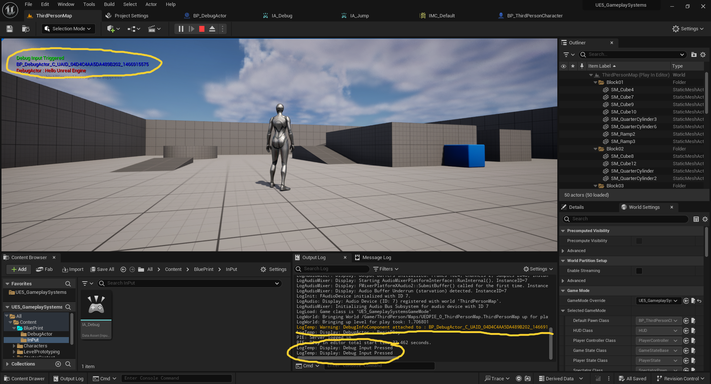
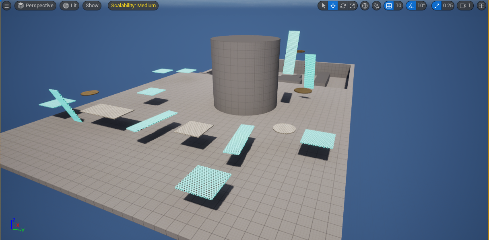
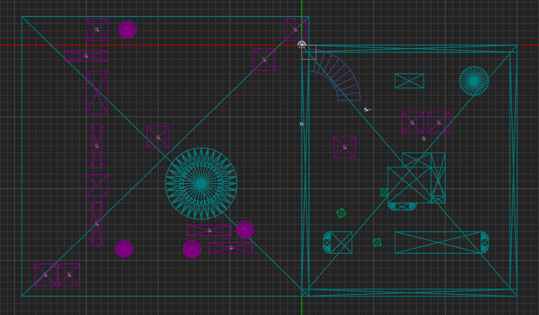
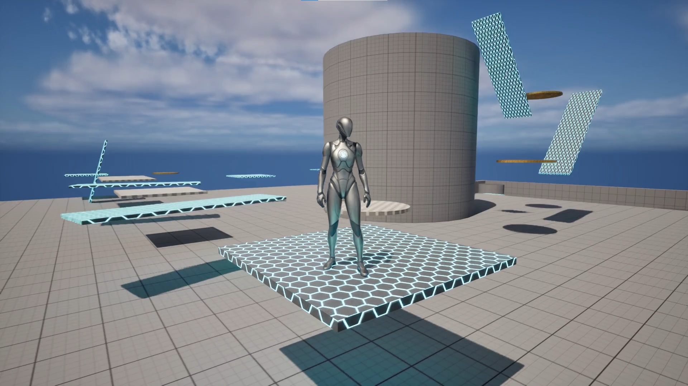
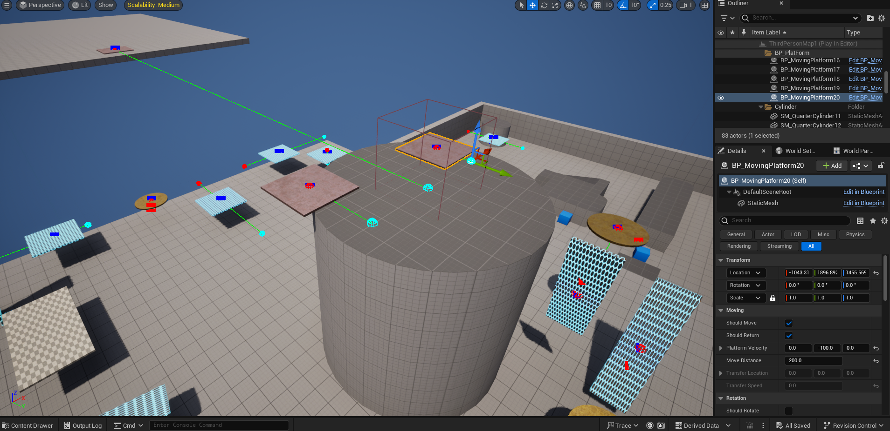

# UE5_GameplaySystems

## 📅 5\1\26
## 📘 Unreal Engine 5 C++ – Development Log

This file tracks my daily work, experiments, and observations
while building gameplay systems in **Unreal Engine 5 using C++**.

The purpose of this log is:
- Long-term reference
- Clear documentation of system-level understanding
- Tracking how gameplay code evolves over time

---

### Project Information
- **Project Name:** UE5-Gameplay-Systems
- **Engine:** Unreal Engine 5
- **Template:** Third Person (C++)
- **Language:** C++
- **Version Control:** GitHub

---

### Work Done
- Created a new Unreal Engine 5 project using the **Third Person C++ template**
- Set up GitHub repository for continuous version control
- Added this development log for documentation and iteration tracking

---

### Technical Notes
- The Third Person template provides a solid baseline for gameplay system development
- Movement, jumping, and camera logic are already implemented and can be extended later
- This setup allows focus on **system design and C++ architecture**.

---

### Repository :- **UE5_GameplaySystems**

🔗 GitHub :  [Anant Shah](https://github.com/AnantShah001)

[UE5_GameplaySystems](https://github.com/AnantShah001/UE5_GameplaySystems)

---

### Screenshots

**Unreal Editor**

**IDE / Source Code**

**Gameplay View**

---

🔗 [GitHub Previous Commit](https://github.com/AnantShah001/UE5_GameplaySystems/commit/b9555e0559055a49e76a37f8694d85c73b611429)

## 📅 Day 1 – Project Setup & Create DebugActor Class
- Created a new class called DebugActor derived from AActor.
- Blueprint child class derived from `ADebugActor`
- Used for level placement and iteration
- Demonstrates proper C++ → Blueprint inheritance workflow
- Implemented functionality to print debug messages using UE_LOG.
- Used GEngine->AddOnScreenDebugMessage to display messages on the game screen.

 > Blueprint Editor Terminology:
* `Viewport` = `This is where we can see our Actor in 3D Space`
* `Event Graph` = `This is Execute After Game Starts`
* `Construction_Script` = `This is Execute Before Game Starts`

**Showing Debugging**

---

🔗 [GitHub Previous Commit](https://github.com/AnantShah001/UE5_GameplaySystems/commit/16a8a9c80c88720d81a8ce84de6a9478d2b71a2b)

## Day 2 – Unreal Engine C++ Project Structure & Gameplay Framework

### Objective
Understand Unreal Engine’s C++ project structure and the responsibility of core gameplay framework classes.

---

### Project Structure Observations

- The `Source/` folder contains the main game module.
- `.Build.cs` defines module dependencies and build rules.
- `Target.cs` separates Editor and Game build configurations.
- The main module files (`UE5_GameplaySystems.cpp/.h`) handle module startup and shutdown.

This helped me understand how Unreal loads and manages C++ code at runtime.

---

### Gameplay Framework Understanding

I studied the responsibility of Unreal Engine gameplay classes:

- **GameMode**  
  Controls game rules and default classes. Exists only on the server.

- **Character**  
  Represents a controllable pawn with movement and collision.
  Handles physical representation in the world.

- **PlayerController**  
  Handles player input and high-level control logic.
  It is NOT the player character itself.

- **Actor**  
  Base class for all gameplay objects.
  Should be used only when world presence is required.

- **Component**  
  Used to add reusable behavior to Actors.
  Preferred over Actors when possible for performance and design clarity.

---

### Actor Lifecycle Review

I reviewed the Actor lifecycle execution order:

* Constructor  
	* Runs when the Actor is created
	* Used to set **default values** and create components
	* Runs **even in the editor**
* OnConstruction  
    * Called after spawning or when a property changes in the editor
	* Great for **editor-time logic**
	* Runs multiple times
* BeginPlay  
	* Called once when the game starts or actor is spawned at runtime
	* Best place for **gameplay logic initialization**
* Tick  
	* Runs every frame (if enabled)
	* Used for continuous updates
* EndPlay  
	* Called when the actor is removed from the level or game ends
	* Used for **cleanup**
* Destroyed  

This clarified when initialization, gameplay logic, and cleanup should occur.

---

### Key Learning

Not all gameplay logic belongs in Actors.
Understanding ownership and responsibility is critical for scalable gameplay systems.

---

## Day 3 – Actor vs Component Design

Focus: Understanding when to use Actors versus Actor Components in Unreal Engine.

What I did:
- Created a reusable C++ Actor Component (DebugInfoComponent)
- Attached the component to an existing DebugActor
- Used the component to access and log its owning Actor
- Observed execution order between Actor and Component lifecycle

Key Learnings:
- Actors represent entities in the world
- Components represent reusable behavior
- Components help reduce duplication and improve scalability
- Not all logic should live inside Actors

This approach will be used for future systems such as health, interaction, and abilities.

---

## Day 4 – Enhanced Input (UE5)

Focus:
Learning and implementing Unreal Engine 5’s Enhanced Input system using C++.

What I did:
- Created Input Actions and Mapping Context
- Added Enhanced Input Mapping Context at runtime
- Bound input actions using UEnhancedInputComponent
- Implemented movement and camera input using FInputActionValue

Key Learnings:
- Input belongs in Character / PlayerController, not Actors
- Enhanced Input is context-based and scalable
- Clean input architecture is critical for future multiplayer support

| Code                                               | Purpose                                                                |
| -------------------------------------------------- | ---------------------------------------------------------------------- |
| `Super::BeginPlay()`                               | Calls the parent class’s BeginPlay to ensure proper initialization     |
| `Cast<APlayerController>(Controller)`              | Ensures the character has a PlayerController controlling it            |
| `GetSubsystem<UEnhancedInputLocalPlayerSubsystem>` | Accesses the Enhanced Input system for this player                     |
| `AddMappingContext(DefaultMappingContext, 0)`      | Activates this character’s input mapping so Jump, Move, Look will work |

---

## Day 5 – Gameplay Framework Deep Dive

### Objective
Understand Unreal Engine’s Gameplay Framework by analyzing
and documenting existing template code without adding new features.

#### GameMode
- GameMode defines game rules and default gameplay classes.
- Exists only on the server.
- Not responsible for player input or per-frame gameplay logic.

#### Character
- Character is a specialized Pawn with built-in movement logic.
- Movement is handled by CharacterMovementComponent.
- Camera behavior is managed using SpringArm + Camera components.

### Why This Matters
Understanding framework responsibilities prevents bad architecture,
such as placing input logic in GameMode or game rules in Actors.

### Next Step
Use this understanding to safely extend gameplay systems
starting Day 6 with input-driven behavior.

---
## Day 6 – Input Handling & Gameplay Flow

Focus:
Understanding how player input flows through Unreal Engine
from input mapping to C++ execution.

What I worked on:
- Reviewed PlayerController vs Character input responsibilities
- Created a custom Enhanced Input Action for testing
- Bound the input action in the Character C++ class
- Verified runtime execution using UE_LOG and on-screen debug messages

Key Learnings:
- Input is owned by the PlayerController but executed by the possessed Pawn
- Input actions should trigger intent, not direct gameplay complexity
- Clean input flow is critical for scalable systems (abilities, interaction, UI)

Outcome:
We now clearly understand where and how gameplay input should be handled
before implementing real systems like interactions or abilities.

**Debug Input**

---
## Day 7 – Moving Platform (Actor System)
### What I built
- Created a reusable Moving Platform Actor in C++
- Platform moves between two locations using Tick and DeltaTime
- Exposed movement values to the editor using UPROPERTY

### Key Concepts Learned
- Tick-based movement and frame-rate independence
- FVector position math
- Actor lifecycle in a real gameplay use-case
- How to design simple but reusable gameplay systems

### Why this matters
Moving platforms are a core level-design mechanic.
This system can be reused, extended, or networked later.

### Notes
- Logic kept in C++, values exposed to designers
- Avoided hardcoding positions

---
## Day 8 – Visual Debugging (Moving Platform)

### What I did
* Added visual debug helpers to the Moving Platform system
* Used `DrawDebugLine` to visualize movement path
* Used `DrawDebugSphere` to mark start and end locations
* Used `DrawDebugPoint` to mark Current Actor Location

### Why this matters
Visual debugging helps understand gameplay behavior without modifying logic
or spamming logs. This is useful for both programmers and designers.

### Takeaway
Debugging visually leads to faster iteration and clearer system behavior.

---
## Day 9 – Rotating Platform System

### What I did
* Extended the Moving Platform system with optional rotation
* Used FRotator for frame-rate–independent rotation
* Exposed rotation settings to the editor for designer control

### Takeaway
Gameplay systems should be modular and configurable rather than hard-coded.

---
## Day 10 – Level Integration & Gameplay Prototype & Playtest Build (Milestone)

### What I did
* Designed a small test level using moving and rotating platforms

* Focused on player flow and timing
* Packaged the project into a playable Windows build
* Shared the build for external playtesting

### Takeaway
Shipping small playable builds early helps validate gameplay systems
and exposes real-world issues faster than theory alone.

**[Package Game UE5_GameplaySystems](https://drive.google.com/drive/folders/1QIhK1hpFOOMEeoCmNDTRWaWlEdhMFzTM?usp=sharing)** 

**[UE5_GameplaySystems.rar](https://drive.google.com/file/d/1p1YuqYr70H9uFD3_ahaFcNEgR23CierQ/view?usp=sharing)**

---
## Day 11 – Trigger Box Zone System (C++)

Implemented a trigger box system using BoxComponent in C++.

What I did:
* Created a Class TriggerBoxZone Component
* Implemented a reusable TriggerBoxZone 
* Used overlap events (Begin / End)
* Displayed runtime “Level Complete”

What I learned:
* Components are ideal for reusable gameplay behavior
* Trigger boxes are core to interaction, checkpoints, and level logic
* UFUNCTION is required for dynamic delegates
* This design scales better for complex systems

---
## Day 12 – Extended an Existing gameplay system (MovingPlatform)

Today I extended an existing gameplay system instead of creating a new one.

* Focused on extending/upgrading my C++ Moving Platform system.
* Add New Features and Implement.
* ShouldMove false Then Platform can't Move
* If ShouldMove True then only set or select PlatformVelocity, MoveDistance.
* ShouldReturn false then Platform stays at the destination instead of returning
* ShouldReturn false then only set or select TransferLocation , TransferSpeed
* ShouldReturn true then Moving Platform stay in Infinity Loop.

**ShouldMove ShouldReturn**

---
## Day 13 - I bridged the gap between trigger detection and world interaction

Implemented a trigger box with Moving platform in C++.

What I did:
* **Integrated Platform Logic** : Added the SetPlatformActive function to bridge the gap between the trigger zone and world mechanics.
* **Implemented Actor Tagging** : Used UGameplayStatics::GetAllActorsWithTag to allow the trigger to find and control specific platforms dynamically via the PlatformTag.
* **Added Filtering** : Finalized the OnlyPlayerCanTrigger logic to ensure only the player (or specific pawns) can activate the sequence.
* **Safety Casting** : Implemented a Cast<AMovingPlatform> check to prevent the code from crashing if a non-platform actor shares the same tag.

 What I learned:
* **Cross-Actor Communication** : I learned how to use Tags as a decoupled way to let components talk to Actors without needing a direct pointer reference in the editor.
* **Component Versatility** : By inheriting from UBoxComponent, I realized I can turn any Actor into a trigger-able object just by adding this component.
* **Safe Pointer Handling** : Reconfirmed the importance of checking if (!OtherActor) and using Cast before calling functions on external classes to maintain engine stability.
* **API Usage** : Gained experience using Kismet/GameplayStatics.h for world-level actor searching within a component class.

---
## Day 14 – Controlled Platform Rotation

### Focus
Implemented limited and controlled platform rotation instead of infinite rotation.

### What I Added
* Initial rotation tracking
* Editor-defined maximum rotation angle
* Conditional rotation stopping
* Clean separation between movement and rotation logic

### Outcome
* Platforms rotate only up to a defined angle
* Rotation behavior is predictable and reusable
* System can be extended with triggers or reverse logic

### Learning
* Always control gameplay behavior with clear limits
* Editor-exposed values make systems designer-friendly

---
## Day 15 – Reversible Target Rotation (State-Based Rotation)

* Implemented **target-based rotation** using Alpha (0 → 1) with Slerp

* Rotation now **automatically reverses** after completion (Start → Target → Start)

* Added rotation direction control without duplicating logic

* Rotation can be reused for:
	* Doors
	* Rotating platforms
	* Hidden passages
	* Puzzle mechanics

* Trigger system cleanly activates rotation, platform logic stays independent

### Key learning:
State + Alpha + Direction flag = powerful, reusable mechanic.

---
## Day 16 - Trigger-Driven Platform State Control (Hold vs Toggle Behavior)

### What I worked on
Today I refined the interaction between TriggerBoxZone and MovingPlatform by introducing a clear behavioral rule instead of hard-coded logic.

I added a control variable inside the trigger component:

### OnlyWhenTrigger
* If `true:` Platform remains active only while the player is inside the trigger
* If `false:` Platform continues its movement or rotation even after the player exits
This change was handled entirely inside the TriggerBoxZone, without modifying platform movement or rotation logic.

### Why this matters
* Separates event control (TriggerBox) from motion execution (MovingPlatform)
* Prevents Tick logic from being broken by overlap events
* Makes the same platform reusable for:
	* Elevators
	* Doors (open/close)
	* Rotating platforms
	* Puzzle mechanics	
	* Technical Takeaways

* Triggers should send commands, not manage motion
* Platforms should finish what they start, unless explicitly told to stop
* Small booleans can define large gameplay behaviors when placed correctly

### This system now supports both:
* `Hold-to-activate` mechanics
* `Fire-and-forget` mechanics

without duplicating code.

---
Day 17 - 
