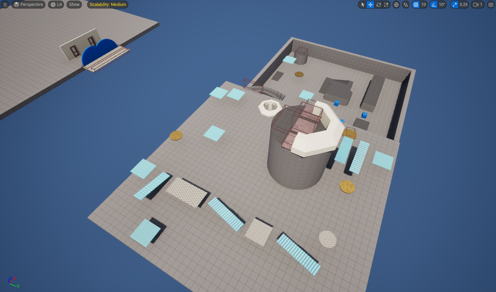
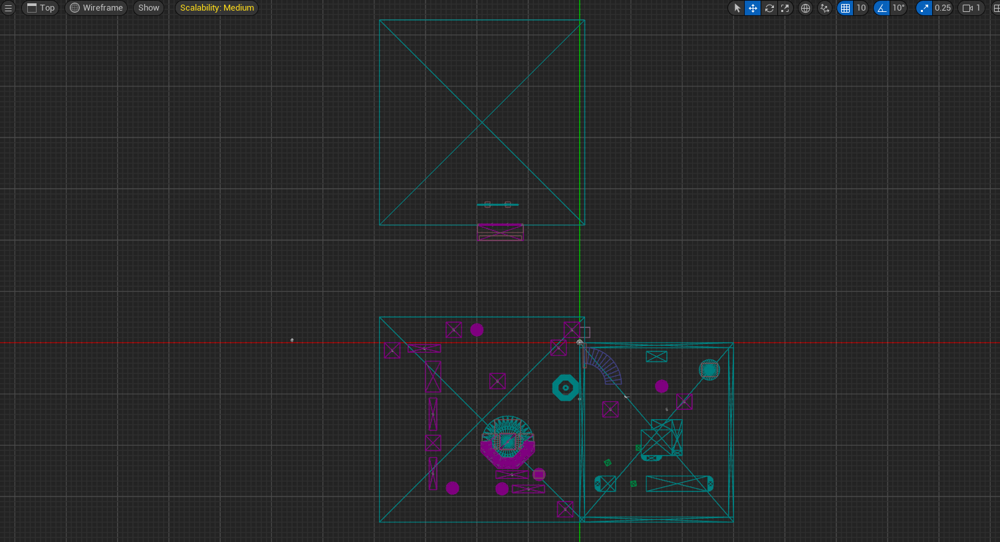
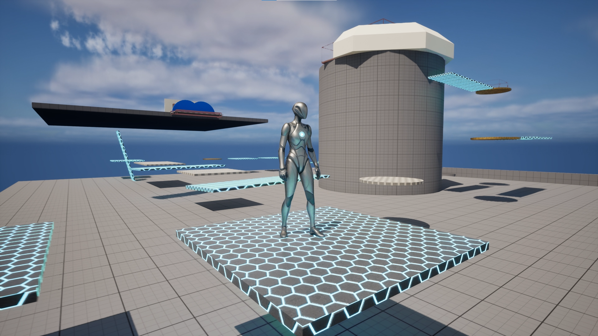

# UE5_GameplaySystems

## 🎮 Project Overview
**UE5_GameplaySystems** is a gameplay systems–focused project built using **Unreal Engine 5** and **C++**.

The goal of this repository is to explore **gameplay architecture, engine behavior,
and system-level experimentation** using Unreal Engine’s C++ framework.
This is not a finished commercial game, but a structured and evolving systems project.

---

## 🎯 Project Goals
- Build gameplay systems using C++ as the foundation
- Deeply Understand Unreal Engine’s gameplay lifecycle and architecture
- Use Blueprint as an extension layer over C++ logic
- Maintain clean version control and documentation
- Ship small playable prototypes for validation

---

## 🚀 Current Scope
- Third Person C++ project as a foundation
- Custom debugging and logging tools
- Gameplay framework analysis (GameMode, Character, Actors)
- Input-driven gameplay behavior (planned)
- Clean version control with focused commits
- Blueprint ↔ C++ inheritance workflow
- Moving and rotating gameplay platforms
- Early level design for system validation
- Playable prototype builds for testing

---

### 🔹 Third Person Character (Template)
- Movement, jumping, and camera logic provided by Unreal Engine
- Used as a stable base for future gameplay systems

---
## 🧩 Gameplay Framework Focus
This project emphasizes understanding **responsibilities**, not just features:

- **GameMode** – Game rules and default class definitions
- **Character** – Player representation and movement systems
- **Actors** – Lifecycle, ticking, and runtime behavior
- **Components** – Modular gameplay logic (ongoing)

---

## 🛠️ Tech Stack
- **Engine**: Unreal Engine 5
- **Language**: C++
- **Template**: Third Person (C++)
- **Version Control**: GitHub

---

## 📂 Repository Structure

```
Source/
 ├─ UE5_GameplaySystems/
 │   ├─ GameMode
 │   ├─ Character
 │   ├─ Public || Private
 │   │   ├─ Debug
 │   │   │   ├─ DebugActor
 │   │   │   ├─ DebugInfoComponent
 │   │   │
 │   │   ├─ Platform
 │   │   │   ├─ MovingPlatform
 │   │   │
 │   │   ├─ ShapeComponent
 │   │   │   ├─ TriggerBoxZone

Source/                   # C++ gameplay and system code
Screenshots/              # Editor & development screenshots
GamePlayScreenshots/      # In-game runtime visuals
README.md                 # Project overview
Log.md                    # Daily development log
```

---

## 🖼️ Screenshots

### Unreal Editor


### IDE / Source Code


### Gameplay View


---

## 🎮 Playable Builds (Prototype)

Early gameplay prototypes are packaged and shared for testing.

> These builds are **system validation prototypes**, not final games.

**Game Level Day 10**


**Game Level Day 20**



**Level Top View Day 10**


**Level Top View Day 20**



**Game View Day 10**


**Game View Day 20**


---

## 🎮 Download Playable Builds (Prototype)

**[Package Game UE5_GameplaySystems](https://drive.google.com/drive/folders/1QIhK1hpFOOMEeoCmNDTRWaWlEdhMFzTM?usp=sharing)** 

**[UE5_GameplaySystems_10.rar](https://drive.google.com/file/d/1p1YuqYr70H9uFD3_ahaFcNEgR23CierQ/view?usp=sharing)**

**[UE5_GameplaySystems_20.rar](https://drive.google.com/file/d/15W1yzYyk_B-hdotzvP8MeQQ-_WsBPG6F/view?usp=sharing)**


---

## 📖 Development Log
Detailed progress, experiments, and technical observations are documented in :
📘 **[Log.md](Log.md)**

---

## 🤝 Connect
- **LinkedIn**: https://www.linkedin.com/in/anantshah001/
- **GitHub**: https://github.com/AnantShah001

---

> Learning in public. Building systems. Shipping small, improving daily.
