# UE5_GameplaySystems

 A modular gameplay systems project built with **Unreal Engine 5 & C++**,
 focused on gameplay architecture, reusable systems, UI workflows,
 checkpoint handling, player state management, and scalable engine patterns.

**Game View Day 40**
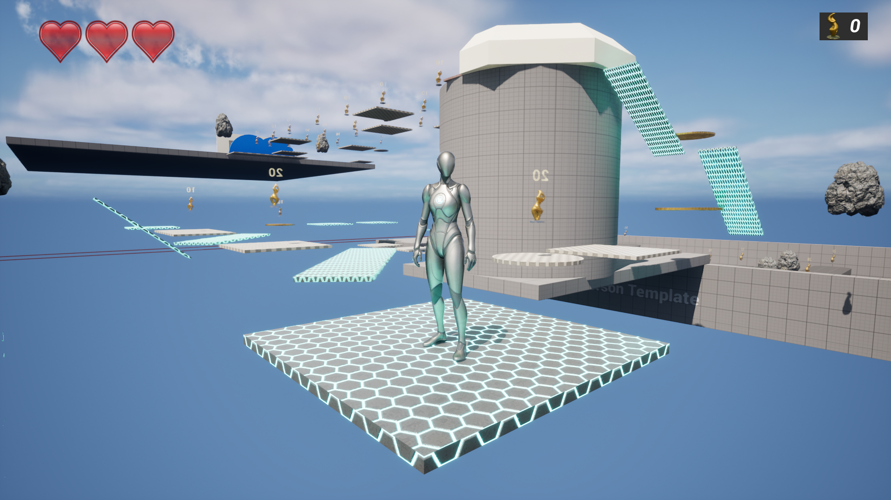

## Project Overview
**UE5_GameplaySystems** is an evolving gameplay engineering project where systems
are designed, tested, refactored, and integrated into playable prototypes.

The focus is not building a single mechanic — but understanding
how **independent gameplay systems communicate and scale together**.

**Current Development Includes:**

- Gameplay Actors & Components
- Crumbling Platforms and Moving Platforms
- Moving Obstacles
- Trigger Systems
- Dynamic UI Systems
- Collectibles Items and UI Score Management
- Checkpoint & Respawn Architecture
- Health / Lives Management
- UI Animation Delegates
- Event-driven UI workflows
- Mobile input experimentation
- Memory-safe UE5 C++ patterns
- Packaging & Prototype validation
- Cross-Platform testing or packaging (PC, Android)

---

# Project Goals

**This project aims to explore:**

- Gameplay Architecture  
- Reusable UE5 C++ Systems  
- C++ Workflows  
- Player State Management  
- Event Driven Programming  
- UI Architecture  
- Optimization & Scalability  
- Prototype Shipping & Testing  

---

# Core Systems Implemented

## Platform Systems

### Moving Platform
- Translation movement
- Rotation systems
- Trigger activation
- Reverse movement logic

### Crumbling Platform
- Delayed destruction
- Sound effects
- Particle effects
- Camera feedback
- Child class inheritance from MovingPlatform

---

## Trigger Systems

### TriggerBoxZone

**Supports:**

- Platform activation
- One-time triggers
- Message display
- Destroy after use
- Player-only activation

---

### DeathTriggerBoxZone
**Handles:**

- Death events
- Physics activation
- Respawn pipeline

---

# Death & Respawn System

**Custom death pipeline:**

- Player Death
- Physics Simulation
- Camera Focus
- Death UI
- Respawn Delay
- Checkpoint Respawn

**Features:**

- No level reload required  
- Restore transforms  
- Restore controls  
- Respawn using checkpoint data  

---

# Checkpoint System

**Built using:**

- Item system
- GameInstance persistence
- Character restoration

**Stores:**

- Respawn location
- Score
- Runtime state

---

# Health & Lives System

**Implemented:**

### Dynamic Heart UI

**Features:**

- Runtime generated hearts  
- Animation driven removal  
- Scalable life count  

**Built with:**

```text
Health_UI
 ├── HorizontalBox
 └── MyLives_UI[]
```

**Animation Delegates used for:**

- Remove after animation finish
- Event-driven UI cleanup

---

# Collectible & Score System

**Features:**

- Collectible Items
- Score increment
- Runtime UI updates
- Persistent score storage

---

# Pause Menu

**Features:**

- Game pause/resume 
- Restart level
- Quit Game

**Managed through:**

```text
PlayerController
      ↓
UUserWidget
```

---

# UI Systems

**Implemented widgets:**

### Score UI
Runtime score update

### Death UI
Fade animation

### Health UI
Heart system

### Pause Menu
Game pause/resume 

---

# Mobile Development

Experimented with:

- Android Packaging  
- Touch Input  
- Camera Rotation  
- Jump Controls  
- Virtual Joystick Configuration  

---

# UE5 C++ Optimization

**Applied:**

### Memory Safety

- `TObjectPtr<>`
- Garbage Collection friendly patterns

### Compilation Optimization

- Forward Declarations
- Reduced include dependencies

### Architecture

- Modular systems
- Reduced coupling
- Cleaner headers

---

# Tech Stack

| Category | Technology |
|---------|-------------|
| Engine | Unreal Engine 5 |
| Language | C++ |
| UI | UMG |
| Scripting | C++ |
| Version Control | Git + GitHub |
| Platforms | Windows + Android |

---

# Repository Structure

```
Source/
 ├─ UE5_GameplaySystems
 │   ├─ UE5_GameplaySystemsGameMode
 │   ├─ UE5_GameplayPlayerController
 │   ├─ UE5_GameplaySystemsCharacter
 │   ├─ UE5_GameplaySystemsGameInstance
 │   ├─ UE5_GameplaySystemsHUD
 │   ├─ Public || Private
 │   │   ├─ Debug
 │   │   │   ├─ DebugActor
 │   │   │   ├─ DebugInfoComponent
 │   │   │
 │   │   ├─ Platform
 │   │   │   ├─ MovingPlatform
 │   │   │   ├─ CrumblePlatform
 │   │   │
 │   │   ├─ ShapeComponent
 │   │   │   ├─ TriggerBoxZone
 │   │   │   ├─ DeathTriggerBoxZone
 │   │   │  
 │   │   ├─ Item
 │   │   │   ├─ Item
 │   │   │
 │   │   ├─ UI
 │   │   │   ├─ Death
 │   │   │   ├─ ScoreUI
 │   │   │   │
 │   │   │   ├─ Health
 │   │   │   │   ├─ Health_UI
 │   │   │   │   ├─ MyLives_UI
 │   │   │   │
 │   │   │   ├─ Menu
 │   │   │   │   ├─ PauseMenu_UI.h

 
Source/                   # C++ gameplay and system code
Screenshots/              # Editor & development screenshots
GamePlayScreenshots/      # In-game runtime visuals
README.md                 # Project overview
LICENSE.txt               # Copyright (c) 2026 Anant Shah. All rights reserved.
Log.md                    # Daily development log
LinkedinPost.md           # LinkedIn post content and videos related to this project
```


**[All Packages Games of UE5_GameplaySystems](https://drive.google.com/drive/folders/1QIhK1hpFOOMEeoCmNDTRWaWlEdhMFzTM?usp=sharing)** All game versions are available in this folder for testing and validation.

**[UE5_GameplaySystems_40.rar](https://drive.google.com/file/d/1pzkMjLs5b1J27s-z6F9PEJB6AOor3q5d/view?usp=sharing)**

**[UE5_GameplaySystems-Android-Shipping_41-arm64.apk](https://drive.google.com/file/d/128-kBn51dJJq-rPotfppvJdI9pnmM15B/view?usp=sharing)** Android 13 support (Under Development or Testing)

---

# Screenshots

## When Project Start Photos

### Unreal Editor
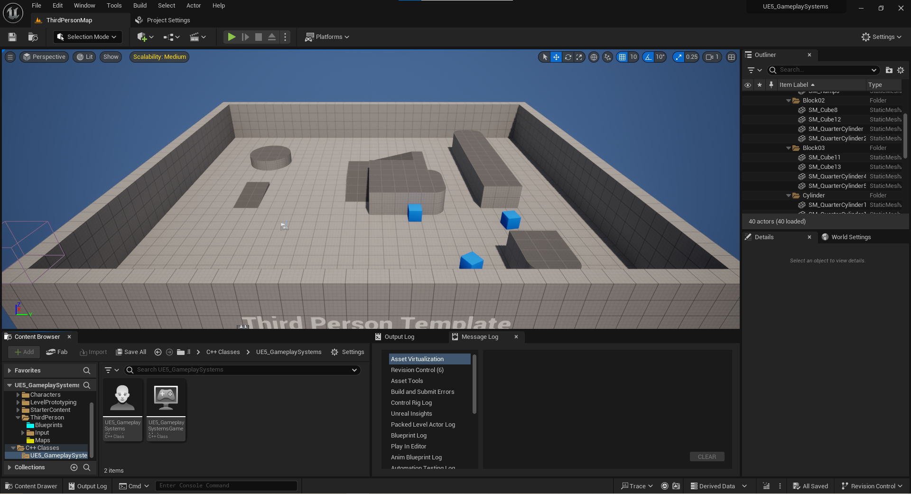

### IDE / Source Code
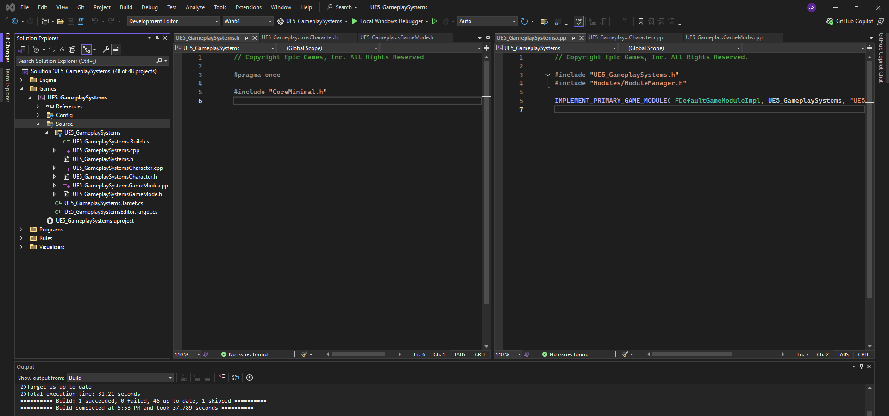

### Gameplay View
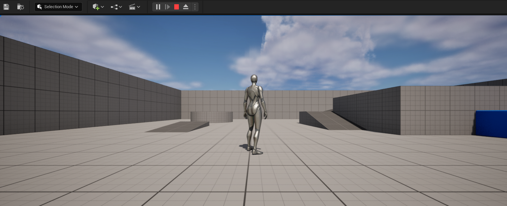

---

## Game Level Photos

**Game Level Day 10**
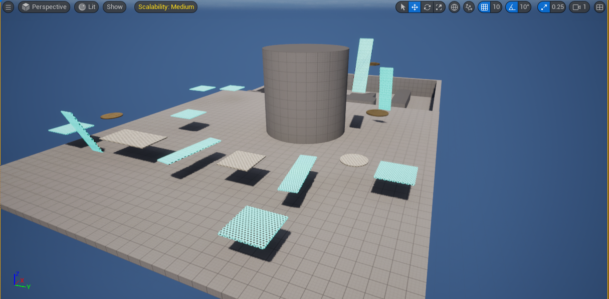

**Game Level Day 20**
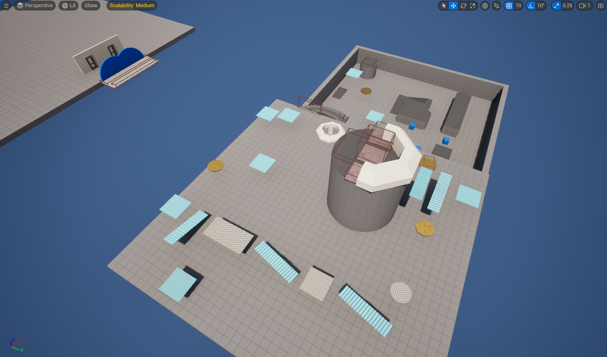

**Game Level Day 30**
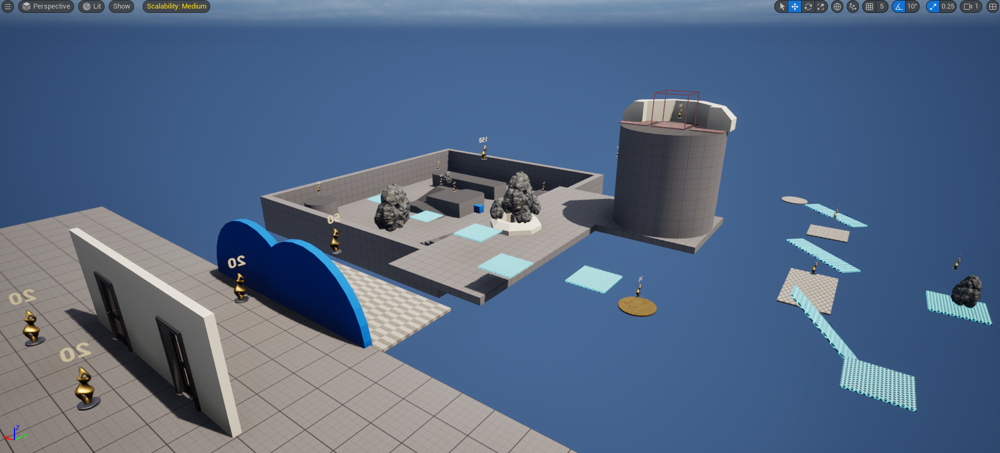

**Game Level Day 40**
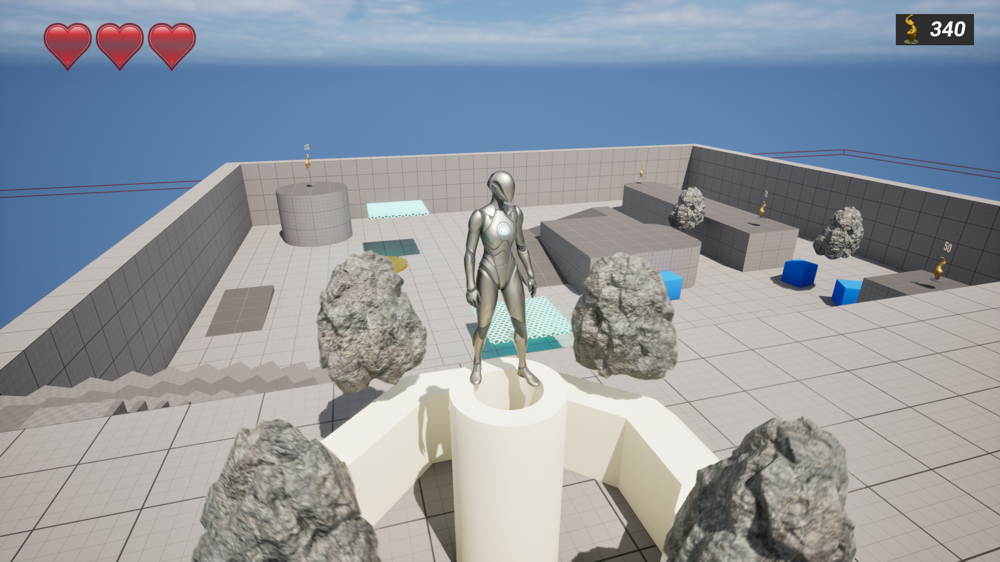

---

## Level View Photos

**Level Top View Day 10**
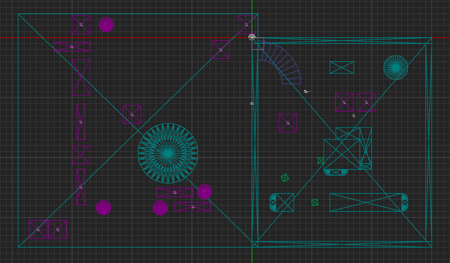

**Level Top View Day 20**
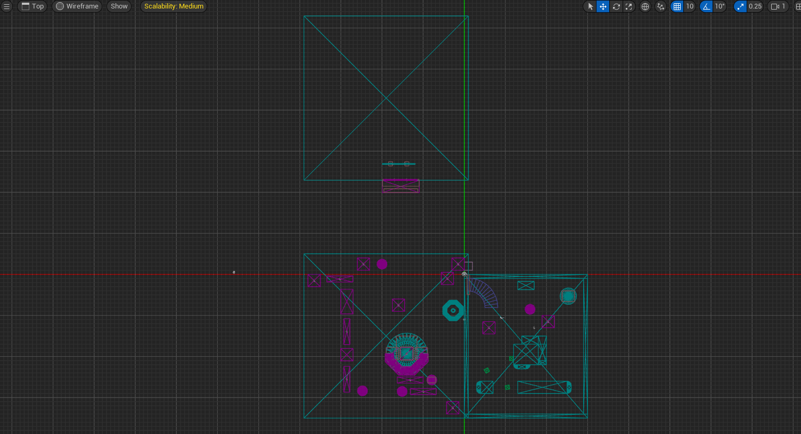

**Level Top View Day 40**
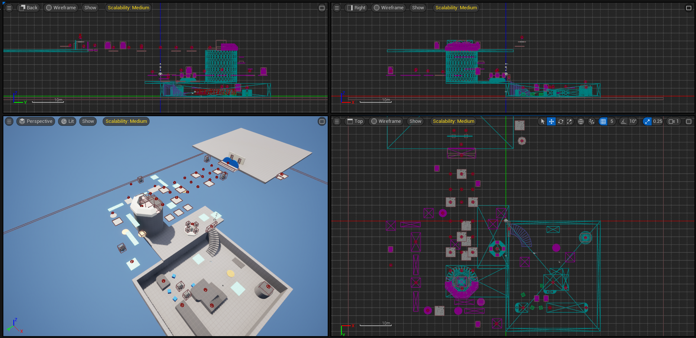

---

## Game View After Packaged

**Game View Day 10**
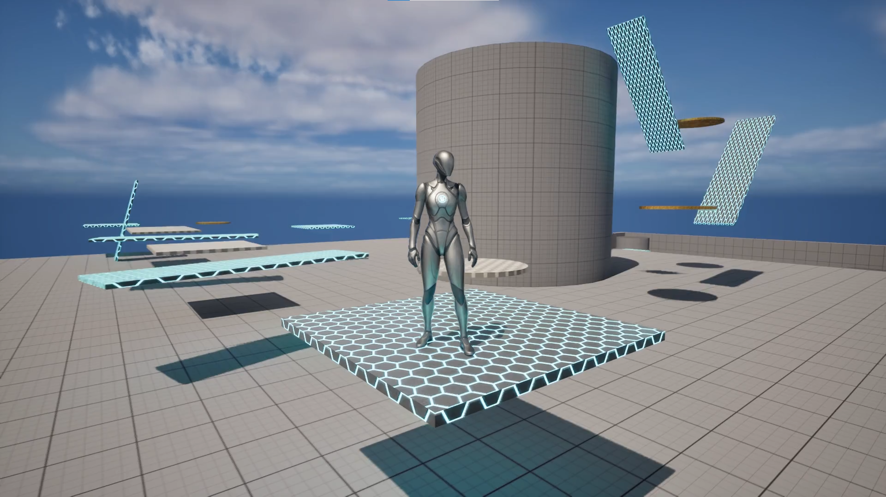

**Game View Day 20**
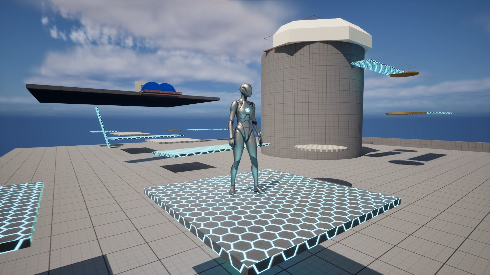

**Game View Day 30**
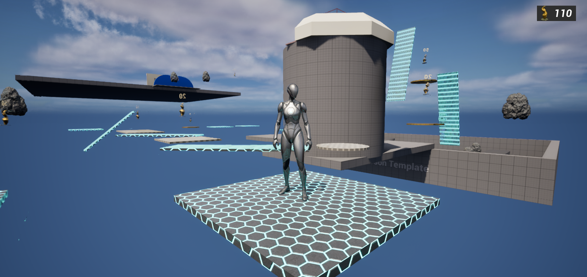

**Game View Day 40**


---

## 🎮 Prototype Builds

**Playable builds packaged during development:**

**[All Packages Games of UE5_GameplaySystems](https://drive.google.com/drive/folders/1QIhK1hpFOOMEeoCmNDTRWaWlEdhMFzTM?usp=sharing)** All game versions are available in this folder for testing and validation.

**[UE5_GameplaySystems_10.rar](https://drive.google.com/file/d/1p1YuqYr70H9uFD3_ahaFcNEgR23CierQ/view?usp=sharing)**

**[UE5_GameplaySystems_20.rar](https://drive.google.com/file/d/15W1yzYyk_B-hdotzvP8MeQQ-_WsBPG6F/view?usp=sharing)**

**[UE5_GameplaySystems-Android_29-arm64.apk](https://drive.google.com/file/d/1eh2OyaVNxtwjzNBWmKYEFtIEHQBiGWMA/view?usp=sharing)** Android 13 support

**[UE5_GameplaySystems_30.rar](https://drive.google.com/file/d/1Cw78KQcelsN4XBtrGAK3xXpPiI71Dzig/view?usp=sharing)**

**[UE5_GameplaySystems_40.rar](https://drive.google.com/file/d/1pzkMjLs5b1J27s-z6F9PEJB6AOor3q5d/view?usp=sharing)**

**[UE5_GameplaySystems-Android-Shipping_41-arm64.apk](https://drive.google.com/file/d/128-kBn51dJJq-rPotfppvJdI9pnmM15B/view?usp=sharing)** Android 13 support (Under Development or Testing)

---

## Development Log
Detailed progress, experiments, and technical observations are documented in :
📘 **[Log.md](Log.md)**

My All LinkedIn Post & Video :
📘 **[LinkedInPost.md](LinkedInPost.md)**

---

# Current Focus

The project is transitioning from:

```text
Learning Mechanics
        ↓
Building Systems
        ↓
Gameplay Architecture
        ↓
Playable Prototype Engineering
```

Future work:

- 3C Systems
- AI Systems
- Mobile UI Input Controls System
- More Gameplay Mechanics
- Ability Systems
- SaveGame integration
- Advanced UI Workflows
- Health System Expansion
- Advanced AI
- Inventory
- Persistent Progression
- Better UI architecture

---

# Connect

- **Email**: shahanant04@gmail.com
- **LinkedIn**: [AnantShah001](https://www.linkedin.com/in/anantshah001/)
- **GitHub**: [AnantShah001](https://github.com/AnantShah001)


## License

Copyright (c) 2026 Anant Shah.
All rights reserved.

---

> Building systems. Shipping prototypes. Improving architecture one iteration at a time.

---